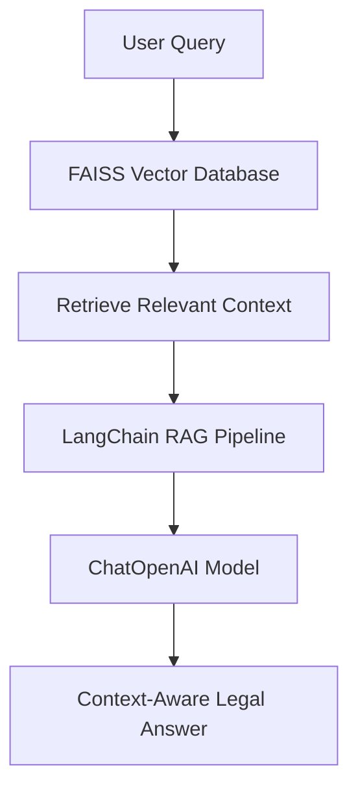

# ⚖️ LegalEase AI — Intelligent Legal Document Assistant

**LegalEase AI** is an advanced **AI-powered legal chatbot** that helps users explore and understand complex legal documents with ease.  
It allows you to upload legal texts (like the Indian Constitution or case law PDFs) and ask natural-language questions — powered by **LangChain**, **OpenAI GPT models**, and **FAISS vector search** for intelligent, context-aware answers.

---

##  Features

-  Upload and analyze legal documents (e.g., PDFs)  
-  Retrieve the most relevant sections using **FAISS**  
-  Ask questions and receive accurate, context-based answers  
-  Uses **OpenAI GPT-4o-mini** or **GPT-4-turbo** for reasoning  
-  Built with **LangChain** for efficient Retrieval-Augmented Generation (RAG)  
-  Interactive user interface built using **Streamlit**  
-  Secure API key management with **python-dotenv**

---

##  System Overview


## Tech Stack

| Component                | Technology                            |
| ------------------------ | ------------------------------------- |
| **Frontend**             | Streamlit                             |
| **Backend Model**        | OpenAI GPT (via `langchain_openai`)   |
| **Framework**            | LangChain                             |
| **Database**             | FAISS (Facebook AI Similarity Search) |
| **PDF Processing**       | PyPDF2                                |
| **Environment Handling** | python-dotenv                         |

---
## 📂 Project Structure

```bash
legalease-ai-chatbot/
│
├── __pycache__/              # Cached Python files
├── .devcontainer/            # Development container configuration
├── pdfs/                     # Folder containing legal documents (PDFs)
├── vectorstore/              # FAISS vector database storage
│
├── .env                      # Environment variables (API keys, etc.)
├── .gitignore                # Files and folders to ignore in Git
├── check_faiss.py            # Script to verify FAISS database functionality
├── debug_retrieve.py         # Debug script for document retrieval testing
├── frontend.py               # Streamlit app interface (main frontend)
├── Pipfile                   # Pipenv dependency management file
├── Pipfile.lock              # Locked versions of dependencies
├── rag_pipeline.py           # Core RAG (Retrieval-Augmented Generation) logic
├── requirements.txt          # Python dependencies for deployment
└── vector_database.py        # FAISS setup and retrieval utility
```
## ⚙️ Installation & Setup

Follow these steps to set up and run the **LegalEase AI Chatbot** locally:

```bash
 1️⃣ Clone the Repository
git clone https://github.com/yourusername/legalease-ai-chatbot.git
cd legalease-ai-chatbot

 2️⃣ Create a Virtual Environment
python -m venv venv

 Activate the virtual environment
venv\Scripts\activate      # On Windows
 OR
source venv/bin/activate   # On macOS/Linux

 3️⃣ Install Dependencies
pip install -r requirements.txt

 4️⃣ Set Up Environment Variables
 Create a .env file in the project root and add:

OPENAI_API_KEY=your_openai_api_key_here

5️⃣ Run the Streamlit App
streamlit run frontend.py
```

##  Example Usage

### User Query:

Which articles mention the right to freedom of speech?

### AI Response:

Article 19(1)(a) of the Indian Constitution guarantees the right to freedom of speech and expression.

---

##  Dependencies
Make sure the following packages are listed in your requirements.txt:
```bash

streamlit
langchain
langchain-core
langchain-community
langchain-openai
faiss-cpu
openai
tiktoken
python-dotenv
PyPDF2

```

---

## 👨‍💻 Author

**Developed by:** Sundaram  
**Institution:** Indian Institute of Information Technology, Dharwad (IIIT Dharwad)  
**Vision:** Building intelligent systems that simplify complex legal information through the power of AI and data-driven insights.

---

## 📬 Get in Touch

I’d love to connect and collaborate on AI, law-tech, or innovative software projects!

- 📧 **Email:** [sundaram95802@gmail.com](sundaram95802@gmail.com)  
- 💼 **LinkedIn:** [https://www.linkedin.com/in/sundaram-5695b629a/](https://www.linkedin.com/in/sundaram-5695b629a/)  
- 💻 **GitHub:** [https://github.com/SundaramDev](https://github.com/SundaramDev)  
- 🌐 **Portfolio:** [portfolio](https://portfolio-mu-ten-mzrtwnfksv.vercel.app/)

---


